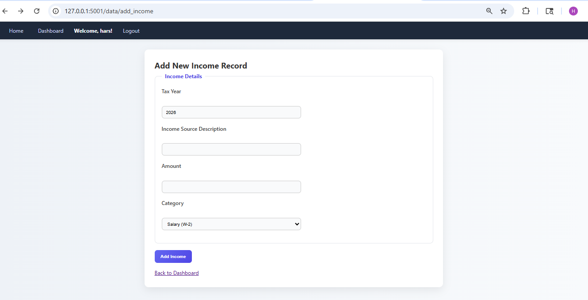

# IndiaTax-Manager


**IndiaTax-Manager** is a lightweight, secure, and fully file-based personal finance and tax calculation web application. Tailored for Indian tax management, it allows users to log incomes, track expenses, determine their tax liability based on their filing profile, and generate beautiful PDF tax summaries. 

Because it uses a custom file-handler instead of a heavy SQL database, it is incredibly easy to set up, highly portable, and perfect for individual use or small-scale deployments.

---

## 📸 Interface Preview

**Add Income Page**  
*Easily log your various income sources for the financial year.*
<div align="center">
  
</div>

---

## ✨ Key Features

*   **🔐 Secure User Authentication:** Full user registration and login system utilizing `Flask-Login` and `Werkzeug` password hashing (pbkdf2:sha256).
*   **📊 Financial Tracking:** Add, categorize, and manage your yearly Income and Expenses. Every entry is assigned a unique UUID for precise tracking.
*   **🇮🇳 Indian Tax Logic Integration:** Connects seamlessly with custom tax calculation logic to compute gross income, taxable income, and final tax liability based on Indian tax rules and user filing status.
*   **📄 Automated PDF Generation:** Instantly generate and download your yearly Tax Summary as a professional PDF.
*   **✉️ Asynchronous Email Notifications:** Built-in threaded `Flask-Mail` support allows the system to send background emails (e.g., alerts, reports) without freezing the user interface.
*   **🗂️ Zero-Setup Database:** Data is stored using a custom `file_handler.py` module (JSON/CSV based). No MySQL, PostgreSQL, or SQLite configuration is required!
*   **📈 Historical Filing View:** Review your tax and financial history year-over-year directly from your dashboard.

---

## 🛠️ Technology Stack

*   **Backend:** Python 3.x, Flask
*   **Extensions:** Flask-Login (Sessions), Flask-WTF (Forms), Flask-Mail (Emails)
*   **Data Storage:** Python native File I/O (`json` / `csv`)
*   **PDF Generation:** Utility script (`generate_summary_pdf`) utilizing libraries like ReportLab or FPDF.
*   **Frontend:** HTML5, CSS3, Jinja2 Templating Engine

---

## 📂 Project Structure

Ensure your project directory looks like this based on the application imports:

```text
IndiaTax-Manager/
│
├── app.py                 # Main Flask application (Routing, Config, App Setup)
├── config.py              # Configuration variables (Secret Keys, Data Dirs, Mail Setup)
├── forms.py               # Flask-WTF forms (Login, Register, Income, Expense, Profile)
├── file_handler.py        # Custom database engine for reading/writing user files
├── tax_logic.py           # Core Indian tax calculation algorithms
├── utils.py               # Helper scripts (e.g., PDF generation)
│
├── asset/                 # 🖼️ Images and visual assets
│   └── ome_page.png       # Screenshot of the Add Income page
│
├── templates/             # Jinja2 HTML Templates
│   ├── base.html
│   ├── auth/              # login.html, register.html
│   ├── input/             # income_entry.html, expenses_entry.html
│   ├── user/              # dashboard.html, profile.html, history.html
│   └── results/           # tax_summary.html
│
└── user_data/             # Auto-generated directory for storing user files
```

---

## 🚀 Installation & Setup

### 1. Clone the Repository
```bash
git clone https://github.com/yourusername/IndiaTax-Manager.git
cd IndiaTax-Manager
```

### 2. Create a Virtual Environment (Recommended)
Isolate your Python dependencies to prevent system conflicts.
```bash
# Windows
python -m venv venv
venv\Scripts\activate

# macOS/Linux
python3 -m venv venv
source venv/bin/activate
```

### 3. Install Dependencies
Make sure your `requirements.txt` includes Flask, Flask-Login, Flask-Mail, and your PDF generation library.
```bash
pip install -r requirements.txt
```

*(If you don't have a requirements.txt, manually install: `pip install Flask Flask-Login Flask-WTF Flask-Mail werkzeug`)*

### 4. Configure the Application
Open `config.py` and ensure the following are set:
*   A strong `SECRET_KEY`.
*   Email configurations (`MAIL_SERVER`, `MAIL_PORT`, `MAIL_USERNAME`, `MAIL_PASSWORD`) if you wish to use the email threading feature.
*   Confirm `USER_DATA_DIR` is set to a secure local path.

### 5. Run the Server
```bash
python app.py
```
*The system will output startup logs and ensure the necessary data directories are created. By default, the app runs on `http://127.0.0.1:5001`.*

---

## 📖 How to Use the Application

1. **Register & Log In:** Navigate to `/auth/register` to create a local account. Your credentials and financial data vault will be automatically generated.
2. **Update Profile:** Go to **Profile** and set your Indian Filing Status (e.g., Individual, HUF, Senior Citizen). *This is required before calculating taxes.*
3. **Log Finances:** Use the **Add Income** and **Add Expense** routes to log your financial events for the current Financial Year.
4. **View Dashboard:** The dashboard provides a real-time overview of your current year's logged finances.
5. **Calculate Taxes:** Click on **Tax Summary** to route your data through `tax_logic.py`. The system will display your Gross Income, Total Deductions, and Final Tax Liability.
6. **Download Report:** Click **Download PDF** to get a physical copy of your yearly tax calculation for your records or CA.

---

## 🧠 Behind the Code: Threaded Emails & Data Handling

*   **Asynchronous Emails:** The app utilizes Python's `threading.Thread` to send emails via `Flask-Mail`. This ensures that when an email is triggered (like a welcome email or password reset), the user's web page doesn't freeze while waiting for the SMTP server to respond.
*   **Custom File Handling:** To keep the application lightweight, `file_handler.py` manages a dictionary-like structure saved directly to the disk. UUIDs are generated for every income/expense entry to ensure data integrity without primary SQL keys.

---

## ⚠️ Security Warning
The application currently runs with `debug=True` and `host='127.0.0.1'` in `app.py`. 
**Do not deploy to a production environment (like AWS, Heroku, or DigitalOcean) with `debug=True`.** Ensure your `user_data/` directory is protected from public HTTP access via your web server configurations (e.g., Nginx/Apache).

---

## 📝 License
This project is open-source and available under the [MIT License](LICENSE).
